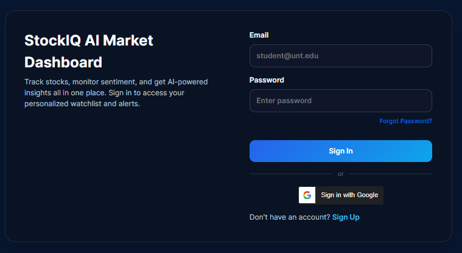
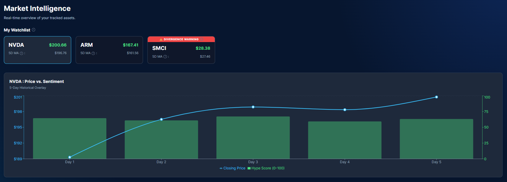
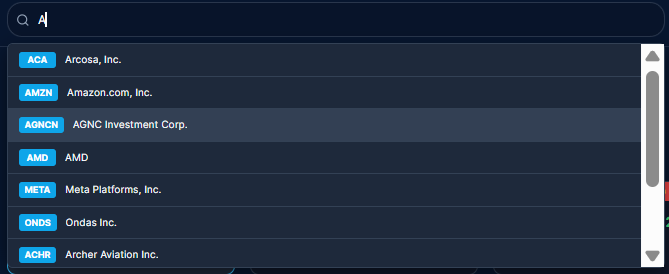
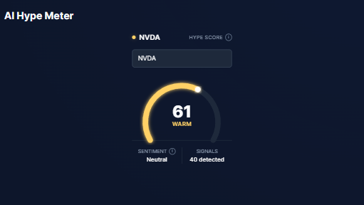
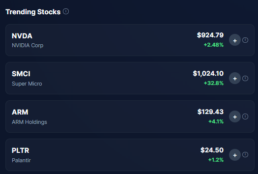
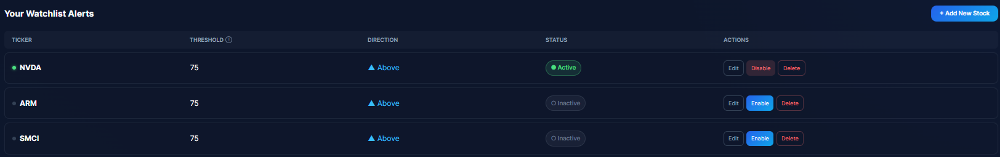
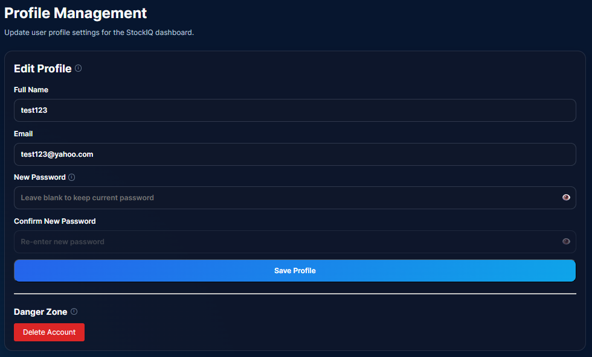

# 404-01-project-CSCE3444 (StockIQ)


**Team Name:** Group 404

**Project Overview:** StockIQ is a financial analytics application designed to quantify public sentiment around specific U.S.-traded stock symbols. By aggregating real-time data from news headlines and social forums to generate a "Hype Score," StockIQ provides contextual insights to help novice investors distinguish between genuine market value and social media noise.

## Current Features
* **Secure Authentication:** Create an account using an email/password (securely hashed with bcrypt) or bypass registration entirely by logging in with Google OAuth 2.0.  

<p align="center">
  
</p>

* **Personalized Dashboard:** Complete a quick onboarding flow to select up to 5 favorite stocks, which populate your home dashboard with live, real-time data.

<p align="center">
  
</p>

* **Live Ticker Search:** Instantly query valid US stock tickers using the integrated yfinance API.

<p align="center">
  
</p>

* **Hype Score & Sentiment Tagging:** View a visual 0-100 speedometer gauge for any stock. Our backend uses VADER NLP to parse recent news and tag the sentiment as Positive, Neutral, or Negative.

<p align="center">
  
</p>

* **Trending Hype Display:** Discover new opportunities by viewing stocks that are currently trending with high social media volume across the market.

<p align="center">
  
</p>

* **Custom Hype Alerts:** Set custom numeric thresholds on specific stocks to receive notifications when market hype exceeds your configured limits.

<p align="center">
  
</p>

* **Profile Management:** Securely manage your account details, update your password, or permanently delete your data and watchlist preferences.

<p align="center">
  
</p>

## Getting Started (Local Development)

To run the StockIQ application locally, ensure you have **Python 3.8+** and **Node.js** installed on your machine. You will need to run the backend and frontend in two separate terminal windows.

### 1. Start the Backend (Flask)
Open a new terminal and navigate to the project root, then run the following commands:

```bash
cd backend

# Create a virtual environment
python -m venv venv

# Activate the virtual environment
# On Windows:
venv\Scripts\activate
# On macOS/Linux:
source venv/bin/activate

# Install dependencies
pip install -r requirements.txt

# Start the Flask server
python app.py
```

### 2. Start the Frontend (React/Vite)
Open a second terminal window, navigate to the project root, and run:

```bash
cd frontend

# Install Node dependencies
npm install

# Start the Vite development server
npm run dev
```

The frontend will typically be accessible at `http://localhost:5173/` (check your terminal output for the exact local URL).

## Team Roster

* **David Oladipupo**
  * **Role:** Repository Owner / Developer
  * **EUID:** do0261
  * **Email:** DavidOladipupo@my.unt.edu
  * **Phone:** 682 246 8060

* **Lance Joseph Trasporto**
  * **Role:** Repository Owner / Developer
  * **EUID:** lat0242
  * **Email:** LanceJosephTrasporto@my.unt.edu
  * **Phone:** 940 758 2193	

* **Patel Jeel**
  * **Role:** Developer
  * **EUID:** jdp0476
  * **Email:** JeelDharmeshkumarPatel@my.unt.edu
  * **Phone:** 580 853 3998

* **Yasas P Timilsena**
  * **Role:** Developer
  * **EUID:** ypt0007
  * **Email:** YasasTimilsena@my.unt.edu
  * **Phone:** 606 898 7367

* **Krish Gautam**
  * **Role:** Developer
  * **EUID:** kg0761
  * **Email:** Krishgautam@my.unt.edu
  * **Phone:** 940 843 7404

## Project Links
* **Trello Board:** [StockIQ Sprint Board](https://trello.com/invite/b/699055a25d002d93008bee54/ATTIb5663ce079b4dbd5a988e69b9a963ac39055F0DD/404-01-project-csce3444)
